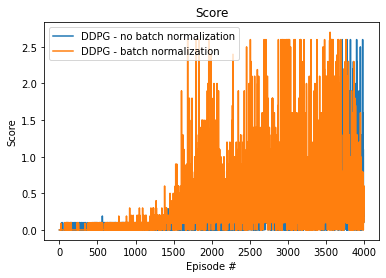
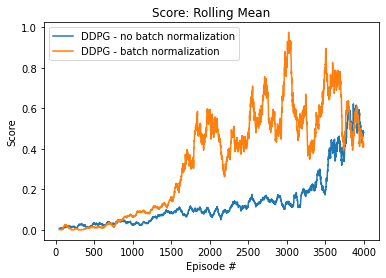

# Report

This report summarizes the implemented methods for the project **Collaboration and Competition** of the Udacity course 
**Deep Reinforcement Learning**. 

## 1 Problem Statement

The goal of the project **Collaboration and Competition** is to train two agents to play tennis. 
Below, we give a description of the problem statement.

We train the agents using reinforcement learning. 
Reinforcement learning is modeled as a Markov Decision Process, in which we have a 

- set of states $\mathcal{S}$,
- set of actions $\mathcal{A}$,
- a set of rewards,
- the one-step dynamics of the environment.

In the project **Collaboration and Competition**, the observation space for each agent has 8 dimensions that represent the 
position and velocity of the ball and racket. Each agent has two actions corresponding 
to the horizontal movement towards and away from the net, and the vertical movement of jumping. Each agent receives a reward of 
 - +0.1 for hitting the ball over the net. 
 - -0.01 for letting the ball hit the ground or letting the ball out of bounds.

We aim to train the agents to interact with the environment such that the expected return, i.e., 
the (discounted) cumulative reward, is maximized. Thus, each agent's goal is to keep the ball in play.

The task is episodic. The environment is solved, if the average maximum score of the agents is at least +0.5 over 100 
consecutive episodes. This means that we sum the reward of each agent after each episode. We then pick the maximum score, 
i.e., the accumulated reward of one agent. This procedure is repeated over 100 consecutive episodes and the resulting scores
are then averaged over the 100 episodes.

## 2 Method and Implementation Details

### Method

We are using the Multi-Agent Deep Deterministic Policy Gradient (MADDPG) method to train the agents, similar to [[1]](#1). The 
method is an extension of the DDPG algorithm for environments with multiple agents. The algorithm belongs to the 
actor-critic methods in reinforcement learning, in which a policy network outputs the optimal actions for a given state and
a critic network estimates the action-value function that yields the expected return for a state $s \in \mathcal{S}$ and 
action $a \in \mathcal{A}$ under the assumption that the agent takes action $a$ in state $s$ and follows the policy for all future time steps. 
The action-value function is also known as Q-value function.

Each agent maintains its own policy and critic network. The policy network considers only the agent's own observations, 
since this is the only information available to each agent during execution time. To facilitate training, we consider
the observations and actions of all agents for updating the critic network that is only used during training time.
In this way, the environment can be considered stationary even if the policies change,
see [[1]](#1). 

Learning from sequential experience tuples (i.e., tuples containing the states, next states, actions and rewards of all agents 
in the environment) can lead to oscillating or diverging Q-values, since sequential experiences can be highly correlated.
Therefore, we keep track of experiences and to store them in a replay buffer and randomly sample small batches of experiences
from the replay buffer to train the policy networks and Q-networks.

To improve convergence, there exists local and target versions of the policy and critic networks. Usually the weights of 
the target networks are fixed for $N$-steps and are then updated with the parameters of the local networks. We use a soft
update.

### Implementation Details

Following steps are executed for each episode:

- Create a new experience tuple $e_t$ by interacting with the environment
- Store $e_t$ in the replay buffer
- If the episode terminates or a maximum number of time steps is reached:
  - For each agent:
    - For n-times:
      - Sample batch from replay buffer
      - Determine experiences for current agent and experiences for all agents in batch
      - Update the local critic network
      - Update the local actor network 
      - Soft update of target actor network
      - Soft update of target critic network

In the current implementation, the training seemed to be more stable when updating the target networks after each update
of the local networks. The parameters for the networks, replay buffer, and the MADDP algorithm can be found in the tables
below. We optionally can use a 1D batch normalization layer for both the actor and critic networks. 

**Actor Network**:

| Layer Nr.                           | Input Size | Output Size | Activation Function |
|-------------------------------------|------------|-------------|---------------------|
| 1                                   | state size | 128         | ReLu                |
| 2 1D Batch normalization (optional) | 128        | 128         |                     |
| 3                                   | 128        | 64          | ReLu                |
| 4                                   | 64         | action size | TanH                |

**Critic Network**:

| Layer Nr.                           | Input Size        | Output Size | Activation Function |
|-------------------------------------|-------------------|-------------|---------------------|
| 1                                   | state size        | 128         | ReLu                |
| 2 1D Batch normalization (optional) | 128               | 128         |                     |
| 3                                   | 128 + action size | 64          | ReLu                |
| 4                                   | 64                | 1           |                     |

**Replay Buffer Parameters**:

| Parameter   | Value |
|-------------|-------|
| buffer size | 1e5   |
| batch size  | 256   |

**MADDPG Parameters**:

| Parameter                                | Value  |
|------------------------------------------|--------|
| Maximum number of time steps per episode | 200000 |
| learning rate actor and critic           | 1e-4   |
| discount factor                          | 0.99   | 
| soft update of target network parameters | 1e-3   |
| number of sequential batch updates       | 3      |

## 3 Evaluation

## 4 Future Work

There are several ways to improve the current implementation, which are discussed below.

### Hyperparameter tuning

The current hyperparameter values have not been extensively tuned. To improve the performance of the algorithm, 
tuning can be done as future work. In particular, following parameter changes can be further investigates:

- the maximum number of time steps per episode can be lowered which may speed-up the training process 
- the learning rate for the actor and critic networks can be increased 
- the batch size can be increased.

### Prioritized Experience Replay

As in [[2]](#2), we could introduce priorization of experiences. There may be some experiences that are more important,
i.e., the agent can learn more from them, as other experiences. The priority $p_i$ of the $i$-th experience is the magnitude of the
temporal difference error:

$$p_i = |\delta_i|+ E,$$ 

with $E > 0$ to ensure that experiences can also be sampled in case $|\delta_i| = 0$. A greater temporal difference error 
corresponds to a higher priority. The priority is used to compute the sampling probability for each experience when:

$$P_i = \frac{p_i^a}{\sum_k p_k^a},$$

where the denominator is the sum of priorities of all experiences in the replay buffer and $a$ is a parameter that prevents 
overfitting to a small set of experiences, see [[2]](#2). Basically, higher values of $a$ mean that the priority of 
experiences has high influence on their sampling probability. In contrast, $a=0$ corresponds to uniform sampling.

## References

<a id="1">[1]</a> 
Lowe, R. *et al.* 
**Multi-Agent Actor-Critic for Mixed Cooperative-Competitive Environments.**
*arXiv* **1706.02275**, (2020).

<a id="1">[2]</a>
Schaul, T. and Quan, J. and Antonoglou, I. and Silver, D.
**Prioritized Experience Replay**
*arXiv* **10.48550/ARXIV.1511.05952**, (2015).
